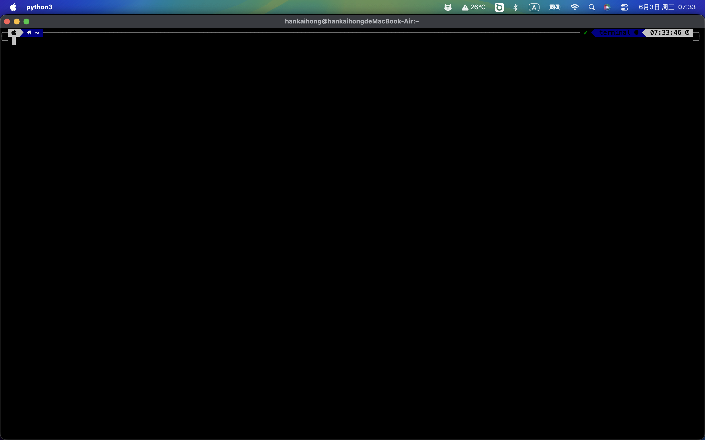

# pyqterminal

A cross-platform terminal emulator — Python frontend, Rust backend.

[中文文档](README_zh.md) | [API Reference](API.md)

<p align="center">
  
</p>

## Documentation

- **[API Reference](API.md)** ([中文](API_zh.md)) — developer guide: embedding TerminalWidget, signals, InputHandler, usage examples
- **[中文文档](README_zh.md)** — Chinese translation of this README

## Features

- 🦀 **Rust-powered TUI** — parses VT520 escape sequences via the `vte` crate
- 🎨 **Full SGR support** — bold, italic, underline (5 styles: straight, double, curly, dotted, dashed), reverse video, dim, blink, strikethrough, hidden text
- 🌐 **CJK** — proper double-width rendering for Chinese, Japanese, Korean
- 🔣 **Nerd Font** — renders icon glyphs (Powerlevel10k, oh-my-zsh themes)
- 🖱️ **Mouse** — text selection with auto-copy, right-click context menu, scrollback with wheel
- 📋 **Clipboard** — Cmd+C / Cmd+V (macOS), Ctrl+Shift+C / Ctrl+Shift+V (Linux/Windows)
- 🔍 **Zoom** — Ctrl++/-/0 adjust font size (6–32pt)
- ⚡ **No buffering** — renders directly via QPainter, no QPixmap double-buffer (Retina-safe)
- 🪟 **Cross-platform** — macOS, Linux, Windows

## Installation

### From PyPI

```bash
pip install pyqterminal
```

Requires Python ≥ 3.12.

### From source

```bash
git clone https://github.com/hanyoukuang/pyqterminal.git
cd pyqterminal
uv sync
```

## Usage

### Interactive mode (default)

```bash
# After pip install
pyqterminal

# Or from source
uv run python main.py
```

### Display-only mode

Use pyqterminal as a pure terminal display — pipe escape sequences from external sources (SSH, logs, etc.) without a local shell:

```bash
# Pipe ANSI output to pyqterminal
echo -e '\x1b[31mHello\x1b[0m\n\x1b[7mReverse\x1b[0m' | pyqterminal --display

# Display SSH session output
ssh user@host 2>&1 | pyqterminal --display

# Programmatic usage
python -c "
from terminal.widget import TerminalWidget
widget = TerminalWidget(rows=24, cols=80, display_only=True)
widget.feed('\x1b[31mRed text\x1b[0m\n')
widget.feed('\x1b[47m\x1b[30mBlack on white\x1b[0m\n')
"
```

Keyboard shortcuts:

| Shortcut | Action |
|---|---|
| `Cmd+C` / `Ctrl+Shift+C` | Copy selection |
| `Cmd+V` / `Ctrl+Shift+V` | Paste |
| `Ctrl++` / `Ctrl+-` / `Ctrl+0` | Zoom in / out / reset |
| `Shift+PageUp` / `Shift+PageDown` | Scroll back / forward |
| Mouse drag | Select text (auto-copied on release) |
| Mouse wheel | Scroll |
| Middle-click | Paste |

## Architecture

```
Interactive:  main.py → TerminalWidget → PtyTerminal (Rust, PTY)
Display-only: main.py → TerminalWidget → Terminal (Rust, headless)
                         ├── InputHandler   (QKeyEvent → terminal bytes)
                         └── QPainter        (direct paintEvent rendering)
```

- **Backend:** [`par-term-emu-core-rust`](https://github.com/paulrobello/par-term-emu-core-rust) — Rust `vte` crate handles PTY, escape parsing, buffer, colors, cursor, scrollback
- **Frontend:** PySide6 `QPainter` — renders directly in `paintEvent()`, no QPixmap double-buffer (avoids Retina/HiDPI issues)
- **Input:** `InputHandler` maps `QKeyEvent` to terminal escape sequences

### Rendering pipeline

```
Shell output → PTY → Rust vte parser → get_line_cells(row) → _render_cells() → QPainter
                                                                    │
                                                     reverse swap · dim · bold/italic
                                                     hidden · blink · wide char (2 cols)
                                                     strikethrough · underline (5 styles)
```

## License

MIT © 2026 Kaihong Han
